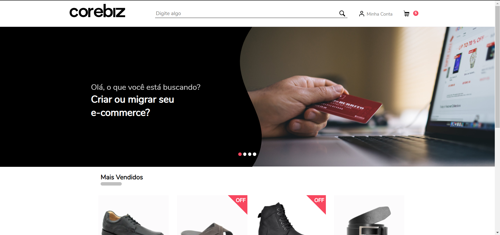
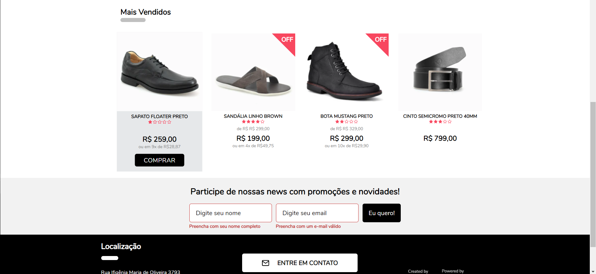
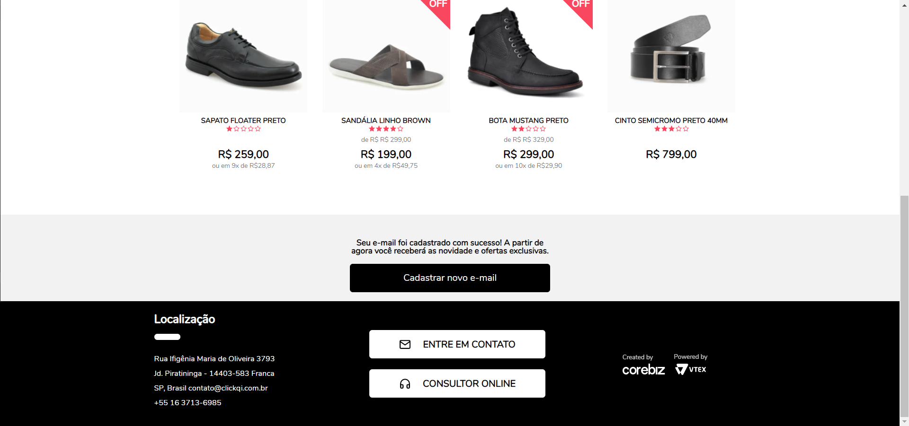

<h1 align="center">
   Challenge Corebiz
</h1>

Este repositório contém um teste desenvolvido para a vaga de desenvolvedor front-end na Corebiz.

O desafio sugerido pela empresa foi de criar uma pagina semelhante ao protótipo neste link: <a href="https://www.figma.com/file/awhTJyKgrjEOqPHUrrFBv0/Corebiz---Frontend-Challenge?node-id=1%3A218">

O projeto ainda tinha as seguintes condiçoes:

- Teria que utilizar a api para listar os produtos. Link da api <a href="https://corebiz-test.herokuapp.com/api/v1/products">

- Teria tambem que registrar um usuário por meio de um formulario, colocando este novo usuário na api de cadastro tambem.Link da api <a href="https://corebiz-test.herokuapp.com/api/v1/newsletter"> , tendo como body e-mail e name do usuário.

- Ao clicar no botão "COMPRAR" o usuário iria adicionar ao carrinho o produto escolhido e este este valor iria aparecer no Header.

O projeto foi desenvolvido com essas tecnologias:

-  [yarn](https://yarnpkg.com/)
-  [Yup](https://www.npmjs.com/package/yup)
-  [ESLint](https://eslint.org/)
-  [Prettier](https://prettier.io/)
-  [VS Code](https://code.visualstudio.com/)
-  [Create-react-app](https://facebook.github.io/create-react-app/docs/getting-started)
-  [Typescript](https://www.typescriptlang.org/)
-  [Styled-components](https://styled-components.com/)

## Resultado final

